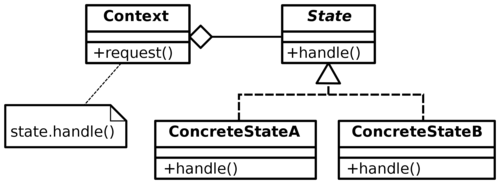

<p align="center">
  
</p>

---

# State Pattern
This pattern provides a way to alter an object's behavior when its internal state changes.
<br />

This pattern states that:

* An object should be able to change its behavior when its internal state changes.
* State-specific behavior should be defined independently. That is, adding new states should not affect the behavior of existing states.

So the solution to define separate (state) objects that encapsulate state-specific behavior for each state.That is, define an interface (state) for performing state-specific behavior, and define classes that implement the interface for each state.
<br />

([more on wikipedia](https://en.wikipedia.org/wiki/State_pattern))

<br />

<p align="center">
  
</p>
<br />

The Context object delegates state-specific behavior to different State objects. 

* First, Context calls operation on initial state object (StateA) then calls setState(StateB) on Context to change context's current state to StateB. 
* The next time, Context again calls operation on its current state object (StateB) and changes context's current state to StateA.


## Example
We need a class that it's print method toggles repeatedly between lowercase and uppercase formats.


## Implementation

```go
package main

import (
	"fmt"
	"strings"
)

// context
type context struct {
	state state
}

func (c *context) setState(newState state) {
	c.state = newState
}

func (c *context) writeString(str string) {
	c.state.writeString(c, str)
}

// state interface
type state interface {
	writeString(*context, string)
}

// concrete state
var lower, upper state

type lowerState struct{}

func (s *lowerState) writeString(c *context, str string) {
	fmt.Println(strings.ToLower(str))
	c.setState(upper)
}

type upperState struct{}

func (s *upperState) writeString(c *context, str string) {
	fmt.Println(strings.ToUpper(str))
	c.setState(lower)
}

func main() {

	lower = &lowerState{}
	upper = &upperState{}

	ctx := &context{
		state: lower,
	}

	ctx.writeString("Monday")
	ctx.writeString("Tuesday")
	ctx.writeString("Wednesday")
	ctx.writeString("Thursday")
	ctx.writeString("Friday")
	ctx.writeString("Saturday")
	ctx.writeString("Sunday")
}

// // execution result :
// monday
// TUESDAY
// wednesday
// THURSDAY
// friday
// SATURDAY
// sunday
```

